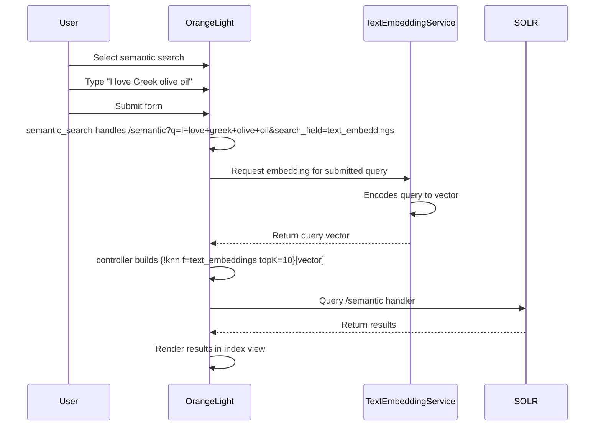

```mermaid
sequenceDiagram
	participant U as User
	participant OL as OrangeLight
	participant TES as TextEmbeddingService
	participant SOLR

	U->>OL: Select semantic search
	U->>OL: Type "I love Greek olive oil"
	U->>OL: Submit form
	OL->>OL: semantic_search handles /semantic?q=I+love+greek+olive+oil&search_field=text_embeddings
	OL->>TES: Request embedding for submitted query
    TES->>TES: Encodes query to vector
	TES-->>OL: Return query vector
	OL->>OL: controller builds {!knn f=text_embeddings topK=10}[vector]
	OL->>SOLR: Query /semantic handler
	SOLR-->>OL: Return results
	OL->>OL: Render results in index view
```