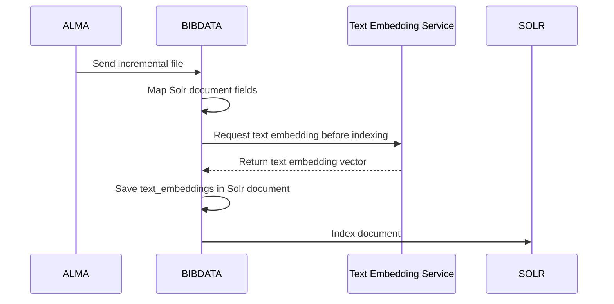

```mermaid
sequenceDiagram
	participant ALMA
	participant BIBDATA
	participant TES as Text Embedding Service
	participant SOLR

	ALMA->>BIBDATA: Send incremental file
	BIBDATA->>BIBDATA: Map Solr document fields
	BIBDATA->>TES: Request text embedding before indexing
	TES-->>BIBDATA: Return text embedding vector
	BIBDATA->>BIBDATA: Save text_embeddings in Solr document
	BIBDATA->>SOLR: Index document
```
